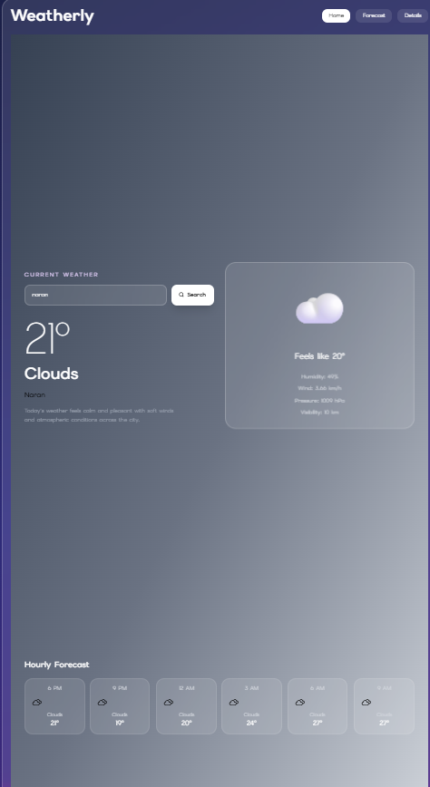
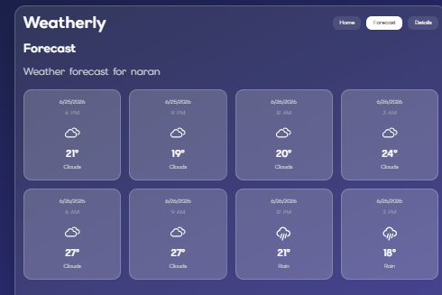
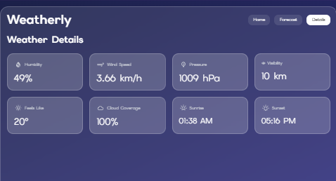

# AI Weather App

A modern weather application built with React.js that provides real-time weather information along with AI-generated weather insights and recommendations. The application features a responsive glassmorphism-inspired user interface and supports dynamic location-based weather searches.

## Features

* Real-time weather information
* AI-generated weather insights
* Dynamic city search
* Responsive design
* Glassmorphism-inspired user interface
* Fast API integration and data fetching

## Technologies Used

### Frontend

* React.js
* JavaScript
* Tailwind CSS
* Vite

### APIs

* OpenAI API
* Weather API

### Tools

* Git
* GitHub
* npm

## Screenshots

### Home Page





## Installation

1. Clone the repository

2. Install dependencies

```bash
npm install
```

3. Add your API credentials

4. Start the development server

```bash
npm run dev
```

## Environment Variables

API keys have been removed from this repository for security reasons.

To run the project locally, create a configuration file and add your own API credentials.

Example:

```env
VITE_OPENAI_API_KEY=your_api_key_here
```

## Future Improvements

* Save favorite locations
* Extended forecasts
* Improved AI recommendations
* Deployment to production

## Author

Aliha Qaiser
